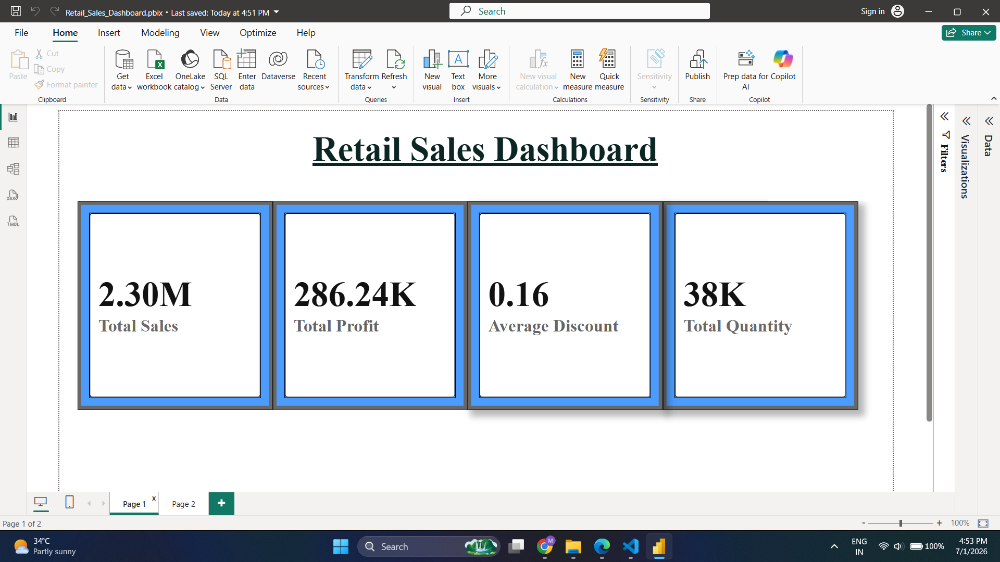
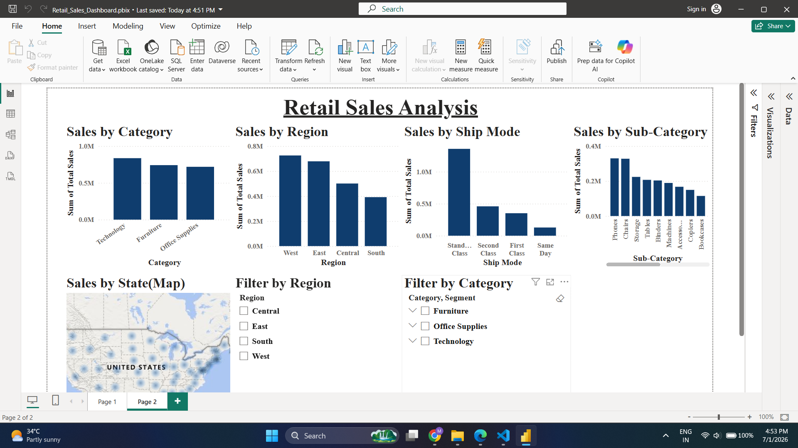

# Retail Sales Dashboard

## 📊 Project Overview

This project is an interactive Retail Sales Dashboard developed using Microsoft Power BI. It provides insights into retail sales performance through KPIs, charts, maps, and interactive filters.

---

## 📌 Dashboard Features

### Page 1 - Dashboard Overview

- Total Sales KPI
- Total Profit KPI
- Average Discount KPI
- Total Quantity KPI

### Dashboard Preview

#### Page 1

---

#### Page 2

---

## 📈 Sales Analysis (Page 2)

- Sales by Category
- Sales by Region
- Sales by Ship Mode
- Sales by Sub-Category
- Sales by State (Map)
- Region Filter
- Category Filter

---

## 🛠 Tools Used

- Microsoft Power BI
- Power Query
- DAX
- Data Modeling
- Data Visualization

---

## 💡 Skills Demonstrated

- Data Cleaning
- Data Transformation
- KPI Development
- Dashboard Design
- Interactive Reporting
- Business Intelligence

---

## 📁 Project Files

- Retail_Sales_Dashboard.pbix
- Retail_Sales_Dashboard.pdf
- Page1.png
- Page2.png

---

## 🎯 Outcome

Designed an interactive Power BI dashboard to analyze retail sales performance using KPIs, charts, maps, and slicers, enabling faster business insights and decision-making.
